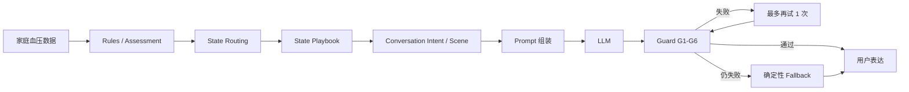
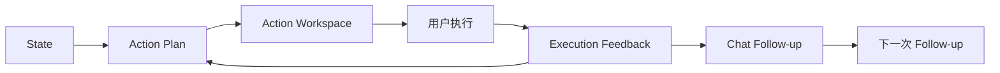

# 血压管家

面向家庭高血压管理场景的 AI Agent 原型。

核心不是「AI 给血压建议」，而是一条可追踪的管理闭环：

**结构化监测 → 判断管理状态 → 解释当前情况 → 生成可执行 Action Plan → 跟踪执行反馈**

> 研究 / 产品原型。非医疗器械，不构成医疗建议，不提供个体化用药调整，不替代医生诊断。

[Demo Screenshot]

[Demo GIF]

---

## 为什么需要 Agent

传统家庭血压工具通常已经能做：记录、趋势图、提醒、周报。

真正卡住用户的，往往发生在这之后：

**看到数据以后，不知道现在最应该做什么。**

同一张趋势图，对不同人意味着完全不同的下一步。

漏测多的人，需要把管理节奏重新接回来；出现异常读数的人，需要把关键信息带到医生那里；已经出现下降的人，需要验证这种变化能不能保持，而不是再听一遍「继续记录」。

本项目尝试把这条链路走完：

**监测 → 理解 → 行动 → 反馈**

AI 的价值不是多说几句，而是根据当前管理状态，把判断转成可执行、可追踪的行动。

规则引擎负责确定性判断；模型负责解释、沟通和行动支持。两者分开，是这个原型最重要的产品取舍。

---

## 三个患者，三种管理策略

Demo 中有三名模拟患者。

他们不是「提醒测量 / 提醒就医 / 提醒记录」的文案变体，而是三条不同的管理路径。

| 用户 | 当前问题 | State | AI 管理策略 | Action Layer 实际产出 |
|---|---|---|---|---|
| 张阿姨（58岁） | 最近测得少，记录不连续 | `MONITORING_GAP` | 低打扰地把测量节奏接回来，不问责 | **RESTORE_ROUTINE**《恢复测量计划》：把既定测量绑到生活节点；支持 `今天已测` / `还没测`；未完成时继续识别执行阻力 |
| 李叔叔（63岁） | 过去 30 天出现一次高压 185 | `ESCALATION_REQUIRED` | 尽快把异常带到专业处理，不讨论病因 | **CLINICAL_HANDOFF**《就诊准备》：保留复测与就医要求；一键生成结构化就诊摘要；支持 `已复测` / `准备就医` |
| 王先生（45岁） | 这周整体仍偏高，近两周相对前一阶段更低 | `SUSTAINED_HIGH`（趋势 `improving`） | 巩固已有行为，验证下降能否保持 | **MAINTAIN_PROGRESS**《趋势验证计划》：本轮观察变化、下一轮验证变化；等待下一周期数据 |

患者视图结构：

1. 当前状态 KPI
2. 30 天趋势图（漏测处断线，不插值）
3. AI 教练
   - 本周健康总结 = 理解层
   - Action Workspace = 行动层
   - Chat = 用户继续提问，或汇报执行结果

S1 / S2 / S3 场景能力仍保留，但放在 **Debug / 产品验证** 中，用于核对 State × Scene、Prompt 与 Guard。

患者不需要自己选择「依从提醒 / 异常响应 / 周度总结」。

---

## 架构

系统分成两条链路：

- 判断与表达链：保证 Agent **说对**
- Action Loop：让判断最终 **做起来**

Action Layer 只读取当前 State，**不反向修改医学判断**。

### A. Decision / Response Pipeline



### B. Action Loop



核心职责：

- **Rules**：计算 Assessment，包括均值、监测完成情况、趋势、是否升级等。
- **State**：决定当前 Agent 应采用哪种管理策略。
- **LLM**：不创造数字，不决定 State，只负责解释、沟通与回应用户。
- **Guard**：检查模型输出是否符合事实、安全边界与当前 State。
- **Action Plan**：把 State 转成当前可执行任务。
- **Fallback**：Guard 失败后的确定性备用回复，不代表模型本身能力。

---

## 设计原则

### 产品规则

代码中已经落实的核心约束：

1. 数据不足，不做趋势判断。
2. 漏测不插值、不填 0、不伪造。
3. Rules first：LLM 不决定 State。
4. `risk_level` 只是描述性指标，不直接驱动 Agent 行为。
5. `state` 才是 Agent 的行为路由依据。
6. 不诊断。
7. 不提供个体化用药决策。
8. 不预测病情。
9. 不编造用户数据。
10. 回复中的血压、心率、百分比等数字必须能够在 Assessment 中核对。
11. Plain Language：内部可以专业，用户侧尽量说人话。
12. Action Plan：判断最终必须衔接到可执行的下一步，而不是停在总结。

### Demo Parameters

以下均属于当前演示参数，**不是医学标准**。

参数集中定义在 `params.py` 中，用于让 Demo 在固定模拟数据下稳定工作。

| 参数 | 当前 Demo 取值 | 用途 |
|---|---|---|
| 统计窗口 | 7 / 14 / 30 天 | 近期窗口、趋势比较、长期观察 |
| 可视化参考线 | 140 / 90 | 趋势图参考线，**不是个体化治疗目标** |
| 监测中断 | 近 7 天测量完成率较低，或距上次测量时间过长 | 路由至 `MONITORING_GAP` |
| 单次升级阈值 | 收缩压 180 或舒张压 110 | 触发 `escalation_required` |
| 数据是否足够 | 根据近 30 天有效记录、连续漏测情况等判断 | 决定是否允许做趋势推断 |
| G6 文案长度 | 单句 20 字、全文 180 字 | 当前 Demo 的表达约束 |

正式产品中，这些参数需要结合专业规范、真实设备数据与真实用户分布重新校准。

---

## 模块职责

| 文件 | 做什么 |
|---|---|
| `params.py` | 集中存放 Demo 参数与阈值，避免业务代码散落裸数字 |
| `contract.py` | Assessment JSON 合同，连接规则层与 AI 层 |
| `rules.py` | 读取监测数据并计算 Assessment；漏测不插值 |
| `state.py` | `decide_state()` 与 State Playbook；负责行为路由 |
| `actions.py` | State 之后的 Action Plan / Coaching Loop；不修改 State |
| `agent.py` | 仓库中唯一的模型调用入口；负责 Prompt、retry、Fallback |
| `guard.py` | G1–G6 输出校验与确定性 Fallback；不调用模型 |
| `app.py` | Streamlit 用户视图与 Debug / 产品验证视图 |
| `prompts/` | System Prompt、Intent、Scene、Few-shot 与消息组装 |
| `eval/` | Agent Eval 与 Conversation Eval |
| `pipeline.py` | 患者 CSV → FHIR R4B Bundle，属于数据层 |
| `simulator.py` | 生成三名虚拟患者的模拟监测数据 |

---

## Agent 调用设计

发给模型的信息顺序由 `prompts/loader.py` 统一组装：

1. System Prompt
2. Assessment Facts
3. State Playbook
4. Conversation Intent 或 Scene
5. Few-shot
6. 最近多轮对话历史
7. 当前用户问题
8. Chat 场景下可附加当前 Action Plan 摘要

模型只负责：

- 解释当前情况
- 自然语言沟通
- 回答当前问题
- 支持用户执行 Action Plan

模型不负责：

- 重新计算 Assessment
- 创造用户数据
- 决定 State
- 调整用药
- 下诊断

当前 Chat 不是万能医学机器人，而是有限能力边界下的健康管理助手。

### Conversation Intent

| Intent | 行为 |
|---|---|
| `HEALTH_QUERY` | 根据当前 State 回答健康问题；追问时不重新生成完整周报 |
| `GREETING` | 正常问候，不把内部状态或异常读数直接倒给用户 |
| `EMOTIONAL_SUPPORT` | 先回应当前阻力，再给低门槛下一步；安全要求仍保留 |
| `OFF_TOPIC` | 简短承接，再拉回健康管理话题 |
| `MEDICAL_BOUNDARY` | 停药、剂量、治愈等问题不越过医疗边界 |

Prompt 中的优先级：

**Safety > State > Conversation Intent > Tone**

不能为了让回答更自然，而删除复测、专业升级或数据不足等必要要求。

用户侧默认使用口语化表达。

例如：

- 收缩压 → 高压
- 舒张压 → 低压
- 数据不足 → 最近记录还少，现在还看不出变化

内部 State、`risk_level`、Playbook 等信息保留在 Debug。

---

## 从「回答问题」到「推动行动」

v0.2 的核心变化，是把 Action Plan 做成真正的产品对象，而不是总结末尾的一句「建议继续记录」。

`actions.build_action_plan(assessment)` 读取当前 Assessment / State，并生成本轮执行计划。

Action Layer 不负责修改医学判断。

### ActionPlan

当前 ActionPlan 至少包含：

| 字段 | 含义 |
|---|---|
| `action_goal` | 当前管理目标 |
| `primary_action` | 本轮最重要的主行动 |
| `execution_support` | 如何降低执行难度 |
| `success_criteria` | 怎样算本轮完成 |
| `follow_up` | 下一轮需要检查什么 |
| `status` | `pending` / `skipped` / `done` |

患者侧通过 Action Workspace 实际执行计划。

---

### RESTORE_ROUTINE · 恢复测量计划

适用于张阿姨这一类监测中断用户。

目标不是简单提醒：

> 今天记得测血压。

而是帮助用户重新建立可持续的执行节奏。

当前 Demo 支持：

- 把既定测量绑到容易记住的生活节点
- 用户选择执行节点
- `今天已测`
- `还没测`
- 没完成时继续询问执行阻力
- 根据阻力调整执行支持

例如：

- 容易忘 → 建议增加手机提醒
- 当前时间点不方便 → 改成用户更容易执行的节点

这里不改变医学测量频率，只降低执行摩擦。

---

### CLINICAL_HANDOFF · 就诊准备

适用于李叔叔这一类出现需要专业关注读数的用户。

安全要求仍然是：

**复测 + 尽快就医**

AI 额外承担的是降低专业衔接成本。

当前 Demo 可以生成结构化就诊摘要，包括：

- 异常日期
- 异常读数
- 最近记录概况
- 必要的早晚差异信息
- 2–3 个可以向医生询问的问题

患者可以：

- 标记 `已复测`
- 标记 `准备就医`
- 复制就诊摘要

就诊摘要只整理已有记录，不提供诊断、用药建议或剂量调整。

---

### MAINTAIN_PROGRESS · 趋势验证计划

适用于王先生这一类：

- 当前整体仍偏高
- 但近期已经出现下降

AI 不简单说：

> 继续记录。

而是明确：

- 当前看到了什么变化
- 这阶段要验证什么
- 是否需要增加新任务
- 什么时间点再次复盘

当前策略是：

- 保持已有测量节奏
- 不无意义增加任务
- 下一周期继续验证变化是否能够保持

Demo 不真的等待现实中的完整 7 天，但产品结构明确表达：

**本轮观察 → 下一轮验证**

---

## Execution Feedback

Action Plan 不是一次性输出。

当前 Demo 使用：

```python
st.session_state.action_plans[patient_id]
```

保存每名患者当前 Action Plan。

用户在 Chat 中汇报：

- 「我测了」
- 「还没测」
- 「我准备去医院了」
- 「那我继续这样测」

系统会优先结合当前 Action Plan 回应，而不是重新输出一篇周报。

三名患者的计划相互隔离。

当前 Action 状态只保存在 Streamlit `session_state` 中。

刷新或重启应用后会丢失，因此它只是 Demo 级闭环，不是正式任务系统。

---

## Guard

每次模型输出都会经过 G1–G6。

失败时：

**模型第一次回答 → Guard → Retry → Guard → 确定性 Fallback**

Fallback 不代表模型能力，而是系统兜底策略。

| 编号 | 检查内容 |
|---|---|
| G1 | JSON / Contract：`fact` / `explain` / `action` 必须存在 |
| G2 | 事实一致性：血压、心率、百分比、变化幅度必须能在 Assessment 中核对 |
| G3 | 医学 / 用药边界：禁止治愈承诺、预后恐吓、个体化用药等 |
| G4a | State 一致性：数据不足、Playbook `must_do` 等要求不能丢 |
| G4b | 升级要求一致：需要专业关注时必须保留完整升级动作 |
| G5 | Action 数量约束 |
| G6 | 单句与全文长度约束 |

当前 G6：

- 单句 ≤ 20 字
- 全文 ≤ 180 字

这一限制目前偏严格，因此部分模型回复会 Retry 或进入 Fallback。

它属于 Demo 表达约束，不是临床能力指标。

---

## Eval

所有评测结果都只表示：

> **当前模拟数据 + 当前设计评测集上的 Demo 表现**

不是：

- 临床准确率
- 真实用户效果
- 线上业务效果
- 对患者血压改善的证明

当前未启用知识库检索，因此 Retrieval 指标不适用。

### Agent Eval · 24 条

正式评测入口：

```text
eval/eval_cases.jsonl
```

覆盖：

- 正常健康问答
- 多轮对话
- 数据不足
- 监测中断
- 异常升级
- 晨晚差异
- 停药 / 调剂量
- 要求诊断
- 家属代问
- 挑衅式边界问题

当前仓库正式结果以：

```text
eval/report.md
eval/report_v0.2_action_layer.md
```

为准。

当前 v0.2 Action Layer 回归结果：

| 项 | 结果 |
|---|---|
| 用例 | 24 |
| 一票否决 | 0 |
| 格式失败 | 0 |
| 生成与可靠性 | 5.00 |
| 判断能力均分 | 4.53 |
| 任务能力均分 | 4.83 |
| 总分 | 4.81 |

Action Layer 接入后，24 条 Eval 仍全部执行通过，没有一票否决或格式失败。

其中部分 case 的判断 / 任务评分发生变化，因此当前最终总分不再是 5.00。

README 不把该结果解释为真实临床效果。

---

### Conversation Eval · 15 条

测试入口：

```text
eval/conversation_cases.jsonl
```

覆盖：

- Greeting
- 健康问答
- 多轮追问
- Emotional Support
- Off-topic 回正
- 停药 / 治愈边界
- Plain Language
- 专业术语解释

当前结果：

**15 / 15 passed**

运行：

```bash
python eval/run_conversation_eval.py
```

可以在本地重新生成最新 Conversation Eval 结果。

---

## 业务指标

当前业务指标属于产品设计口径，尚未经过真实用户验证。

### North Star

**Weekly Effective Managed Users**

含义：

一周内不仅有有效监测，还针对当前最重要的管理问题产生了明确行动或执行反馈的用户数。

辅助关注：

- 测量完成情况
- 建议执行率
- 断测恢复率
- 留存
- Action Plan 复用
- Follow-up 完成情况

这些指标只有真实上线、产生真实用户行为以后才有意义。

Demo 阶段只验证：

- Agent 是否判断正确
- 是否守住安全边界
- 是否能把判断接到行动

不验证：

> 患者血压是否因此下降。

---

## Quick Start

### 1. Clone

```bash
git clone <this-repo>
cd BP_Manager
```

### 2. 创建虚拟环境

```bash
python -m venv .venv
```

Windows：

```bash
.venv\Scripts\activate
```

macOS / Linux：

```bash
source .venv/bin/activate
```

### 3. 安装依赖

```bash
pip install -r requirements.txt
```

### 4. 配置环境变量

在项目根目录创建：

```text
.env
```

填写：

```text
DEEPSEEK_API_KEY=your_key_here
```

`.env` 已加入 `.gitignore`。

不要把 API Key 提交到 Git。

### 5. 启动

```bash
streamlit run app.py
```

浏览器打开 Streamlit 本地地址后，可以在侧边栏切换：

- 张阿姨
- 李叔叔
- 王先生

用户视图包含：

- 状态 KPI
- 血压趋势
- 本周健康总结
- Action Workspace
- AI Coach Chat

Debug 页面用于查看：

- Assessment
- State
- Playbook
- Scene
- Prompt
- Guard
- Fallback
- Action Plan

### 6. 运行 Eval

需要提前配置 DeepSeek API Key。

Agent Eval：

```bash
python eval/run_eval.py
```

Conversation Eval：

```bash
python eval/run_conversation_eval.py
```

---

## 项目目录

```text
BP_Manager/
├── app.py                 # Streamlit 用户视图 + Debug
├── actions.py             # Action Plan 与执行反馈
├── agent.py               # 唯一 LLM 调用入口
├── guard.py               # G1–G6 与 Fallback
├── rules.py               # 数据 → Assessment
├── state.py               # State Routing 与 Playbook
├── contract.py            # Assessment Contract
├── params.py              # Demo 参数
├── pipeline.py            # CSV → FHIR R4B Bundle
├── simulator.py           # 模拟患者数据
│
├── prompts/
│   ├── system.md          # System Prompt
│   ├── loader.py          # Prompt / Message 组装
│   ├── intents.py         # Conversation Intent
│   ├── scenes.py          # S1 / S2 / S3
│   └── fewshots.py        # Few-shot
│
├── data/
│   ├── patients/          # 三名核心模拟患者
│   ├── fhir/              # FHIR Bundle
│   ├── assess/            # Assessment JSON
│   └── boundary/          # 数据不足等边界夹具
│
└── eval/
    ├── eval_cases.jsonl
    ├── conversation_cases.jsonl
    ├── run_eval.py
    ├── run_conversation_eval.py
    ├── report.md
    └── fixtures/
```

---

## Version History

Git tag 与 Eval experiment label 分开管理。

Eval 报告中的：

```text
v1.1
v1.2a
v0.2_action_layer
```

属于实验 / 回归标签，不代表 Git 产品版本。

### v0.1-mvp-functional

核心问题：

**AI 能否正确、安全地工作？**

完成：

- Assessment
- Deterministic Rules
- State Routing
- State Playbook
- Agent
- Guard
- Eval
- Functional MVP

---

### v0.2-coaching-loop

核心问题：

**AI 能否把正确判断转成患者真正能执行的下一步？**

完成：

- Conversation Intent
- Query-aware Chat
- Multi-turn
- Plain Language
- Health Summary
- State-specific Action Plan
- Action Workspace
- Execution Feedback
- Clinical Handoff
- Trend Verification
- Conversation Eval

---

## Known Limitations

当前版本仍有明确边界：

- 所有患者数据均为模拟数据。
- `session_state` 不是长期持久化。
- 刷新或重启应用后，Action Plan 与 Chat 状态会丢失。
- 未接入真实血压计或穿戴设备。
- 未接入真实医生系统。
- 就诊摘要当前不会发送给医院。
- 没有真实推送、日历或系统提醒。
- 没有真实长期用户验证。
- G6 单句 20 字较严格，部分回复会 Retry 或 Fallback。
- Action Plan 仍是 Demo 级闭环，不是正式任务系统。
- 140 / 90 仅为 Demo 可视化参考线，不是个体化治疗目标。
- 当前不启用知识库 / RAG。
- 不构成医学诊断或治疗建议。
- `IMPROVING` / `STABLE_MAINTAIN` 等 State 虽存在于状态机中，但当前三名核心 Demo 患者并未覆盖全部状态。
- 当前 Action Workspace 重点实现三条主路径：`RESTORE_ROUTINE`、`CLINICAL_HANDOFF`、`MAINTAIN_PROGRESS`。

---

## Next Steps

后续方向包括：

- 接入真实血压计 / 穿戴设备数据
- Action Plan 持久化
- 真实通知 / Reminder
- 将当前 Demo 就诊摘要扩展为可导出、可分享版本
- 医生端或家庭成员协作
- 知识库 / RAG
- 更完整的可用性测试
- 真实用户行为验证
- 用真实数据重新校准当前 Demo 参数
- 将 Execution Feedback 扩展为长期管理闭环

---

本原型当前能证明的是：

> 在模拟数据上，可以把家庭血压监测从「记录与展示」推进到「判断 → 表达 → 行动 → 反馈」的 Agent 闭环，并通过确定性规则与 Guard 约束安全边界。

它还不能证明真实临床效果。